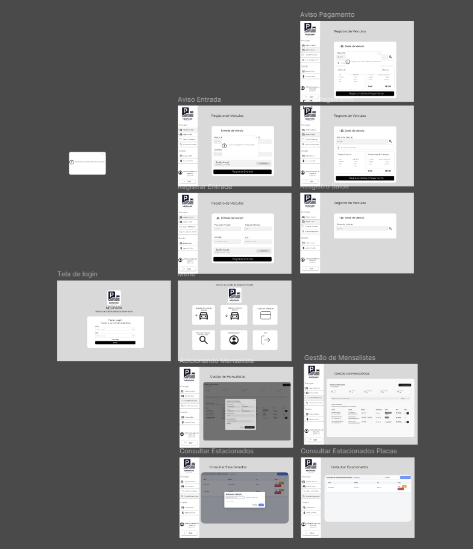
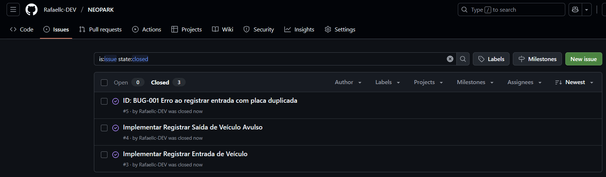
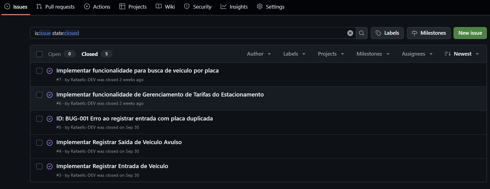

# NEOPARK

**NEOPARK** é um Sistema de gestão de estacionamento projetado para resolver os problemas de processos manuais, como o controle impreciso de veículos e pagamentos, que são comuns em estacionamentos sem automação.  

A aplicação web será acessada exclusivamente por um operador, que fará login para gerenciar o fluxo dos veículos, dos mensalistas, dos pagamentos e a emissão de relatórios. O sistema centraliza todas as operações em uma interface simples e intuitiva, com o objetivo de aumentar a eficiência e a lucratividade do estacionamento.

---

## 📄 Documentações e Entregas

 

---
## 🤝 Como Contribuir para o Projeto

Para saber como contribuir, veja nossas [Diretrizes de Contribuição](CONTRIBUTING.md).

---

## 👥 Equipe

<table>
  <tr>
    <td align="center"><b>Caio Marques Emerenciano</b> <a href="mailto:cme@cesar.school">cme@cesar.school</a></td>
    <td align="center"><b>Eduardo Américo Bezerra da Silva</b> <a href="mailto:eabs2@cesar.school">eabs2@cesar.school</a></td>
    <td align="center"><b>João Vítor do Sacramento Bezerra da Cunha Costa</b> <a href="mailto:jvsbcc@cesar.school">jvsbcc@cesar.school</a></td>
    <td align="center"><b>Luiz Gustavo Gonçalves da Silva</b> <a href="mailto:lggs@cesar.school">lggs@cesar.school</a></td>
    <td align="center"><b>Rafael Lyra Costa</b> <a href="mailto:rlc3@cesar.school">rlc3@cesar.school</a></td>
  </tr>
</table>

---

## 📦 Entregas

  
🚀 Entrega 1

   

  ### 📄 Figma
  

  

   
  
  

 

  
🚀 Entrega 2

   

   
    
  

  ### 📄 Issues
  
   

  
🚀 Entrega 3

---

   
  
  

### 📄 Issues

 

  
🚀 Entrega 4

  

   
  
  

### 📄 Issues

 

  Para saber como contribuir, veja nossas [Diretrizes de Contribuição](CONTRIBUTING.md).

   

---

## 💡 Observações

> Projeto desenvolvido na disciplina de **POO (Programação Orientada a Objetos) – 2025.2** na CESAR School.

